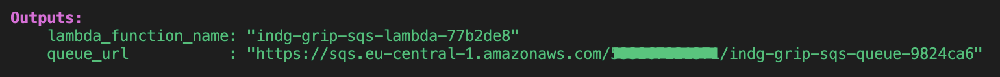
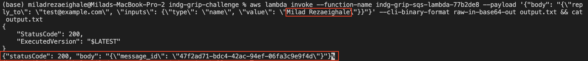
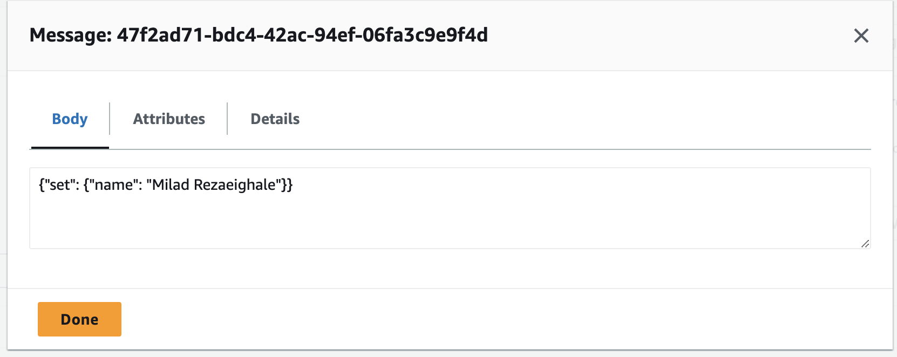

# INDG Grip challenge

This project deploys a Lambda function that receives HTTP requests and sends messages to an SQS queue using Pulumi for infrastructure as code.

## Project Structure

```
indg-grip-challenge/
├── lambda/
│   ├── lambda_function.py
│   └── requirements.txt
├── pulumi/
│   └── __main__.py
```

## Prerequisites

- Python 3.8 or later
- Pulumi CLI
- AWS CLI configured with appropriate credentials

## Setup

1. Clone the repository:
   ```
   git clone https://github.com/miladaws/indg-grip-challenge
   cd indg-grip-challenge
   ```

2. Install dependencies:
   ```
   pip install -r pulumi/requirements.txt
   pip install -r lambda/requirements.txt
   ```

## Deployment

1. Navigate to pulumi folder:
   ```
   cd pulumi
   ```

2. Initialize a new Pulumi stack:
   ```
   pulumi stack init dev
   ```

3. Configure the AWS region:
   ```
   pulumi config set aws:region eu-central-1 # Replace your region
   ```

4. Deploy the stack:
   ```
   pulumi up
   ```

## Usage

After deployment, Pulumi will output the Lambda function name and SQS queue URL. You can use these to invoke the Lambda function and check the SQS queue for messages:

Take note of the `lambda_function_name` and `queue_url` values.

Next, you can use these values to invoke the Lambda function with the following cURL command:



To invoke the Lambda function using AWS CLI:

```
aws lambda invoke --function-name <lambda-function-name> --payload '{"body": "{\"reply_to\": \"test@example.com\", \"inputs\": {\"type\": \"name\", \"value\": \"John Doe\"}}"}' --cli-binary-format raw-in-base64-out output.txt && cat output.txt
```

You will get a response consist of the status code (following image):



The response of lambda invokation will be written in output.txt in the root folder.

You can retrieve messages from the SQS queue using your console, as shown in the following image:



## Clean Up

To remove all resources created by this project:

1. Navigate to pulumi folder:

```
cd pulumi
```

2. Destroy the resources:
```
pulumi destroy
```